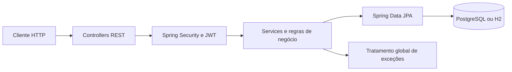

# Você Aluga

API para gerenciamento de locação de veículos, desenvolvida com **Java 21** e **Spring Boot 3**. O sistema administra reservas, pagamentos, veículos, manutenção, estoque, filiais, transferências e usuários.

## Destaques técnicos

- Regras transacionais para sincronizar os estados de reservas e veículos
- Autenticação e autorização com Spring Security e JWT
- Persistência com Spring Data JPA, Hibernate e PostgreSQL
- Ambiente de desenvolvimento e testes com banco H2 em memória
- DTOs, validação, paginação e tratamento global de exceções
- Testes automatizados com JUnit 5 e Mockito
- Diagramas de arquitetura, classes, pacotes e sequência em PlantUML

## Tecnologias


- Java 21
- Spring Boot 3.5.3
- Spring Web
- Spring Data JPA / Hibernate
- Spring Security / JWT
- PostgreSQL e H2
- Maven
- JUnit 5 e Mockito

## Domínios da aplicação

- Reservas
- Pagamentos
- Veículos
- Manutenções
- Estoque
- Filiais
- Transferências entre filiais
- Usuários

## Regras de negócio em destaque

- Uma reserva altera o estado do veículo de acordo com o seu ciclo de vida.
- Operações de reserva são executadas de forma transacional para manter a consistência dos dados.
- Veículos podem ser associados a filiais e transferidos entre unidades.
- Pagamentos, manutenções e movimentações de estoque possuem fluxos próprios.
- Endpoints protegidos exigem autenticação por JWT.
- Consultas de listagem oferecem paginação e validação de parâmetros.

## Arquitetura



O backend utiliza separação entre controllers, services, repositories, entidades e DTOs. As regras de negócio ficam concentradas na camada de serviço, enquanto o acesso a dados é realizado com Spring Data JPA.

## Estrutura do repositório

```text
voce-aluga/
├── backend/                         # API Java/Spring Boot
├── frontend/                        # Aplicação cliente
├── diagrama-arquitetura.puml
├── diagrama-classes.puml
├── diagrama-pacotes.puml
└── diagrama-sequencia-reserva.puml
```

## Como executar o backend

### Pré-requisitos

- Java 21
- Maven 3.9 ou superior
- PostgreSQL, caso seja utilizado o perfil `hmg`

### Clonar o projeto

```bash
git clone https://github.com/alexsanjr/voce-aluga.git
cd voce-aluga/backend
```

### Executar com H2

Linux ou macOS:

```bash
DB_AMBIENT=test mvn spring-boot:run
```

PowerShell:

```powershell
$env:DB_AMBIENT = "test"
mvn spring-boot:run
```

O console do H2 fica disponível em:

```text
http://localhost:8080/h2-console
```

Configuração padrão do perfil de teste:

```text
URL: jdbc:h2:mem:testdb
Usuário: sa
Senha: vazia
```

### Executar com PostgreSQL

Configure as variáveis abaixo:

```env
DB_AMBIENT=hmg
DB_URL=jdbc:postgresql://localhost:5432/voce_aluga
DB_USERNAME=postgres
DB_PASSWORD=postgres
```

Depois execute:

```bash
mvn spring-boot:run
```

> Utilize credenciais próprias fora do ambiente local e não versione arquivos `.env` com segredos.

## Testes

```bash
mvn test
```

Os testes utilizam JUnit 5, Mockito e os recursos de teste do Spring Boot.

## Diagramas

- [Arquitetura](diagrama-arquitetura.puml)
- [Classes](diagrama-classes.puml)
- [Pacotes](diagrama-pacotes.puml)
- [Sequência da reserva](diagrama-sequencia-reserva.puml)

## Autor

Desenvolvido por [Alex Cordeiro](https://github.com/alexsanjr).

